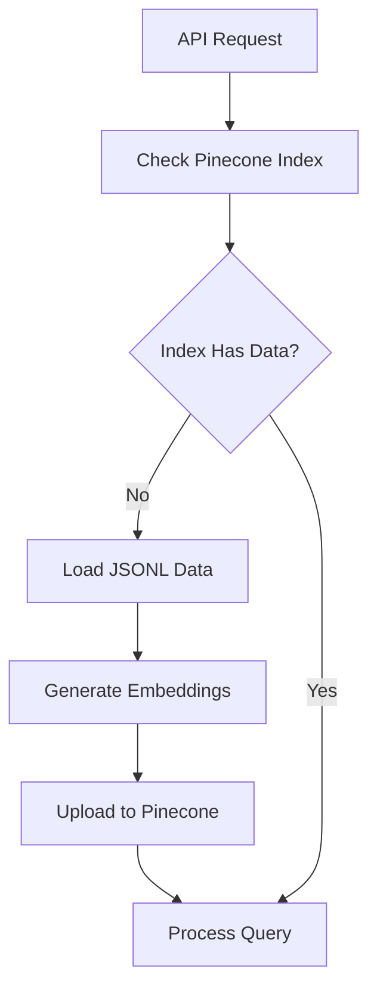
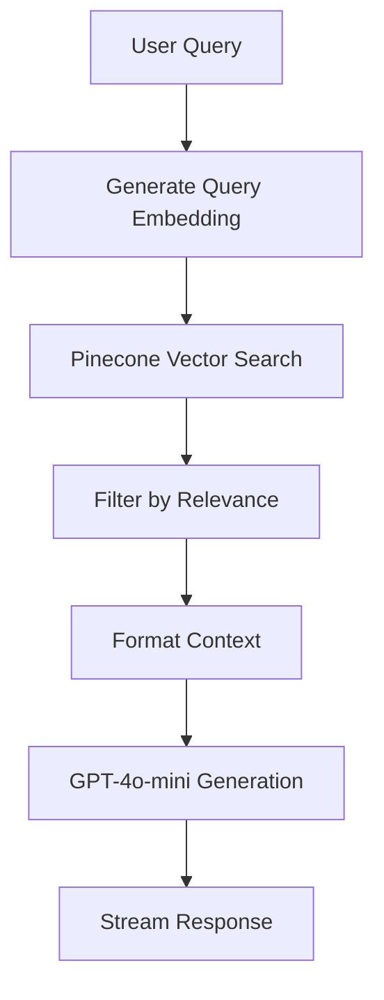

# Pinecone Integration Setup Guide

## Overview
This guide explains how to set up and use the Pinecone-powered Ayurvedic Knowledge Assistant in your Next.js RAG application.

## Prerequisites
1. **Pinecone Account**: Sign up at [pinecone.io](https://pinecone.io)
2. **Pinecone API Key**: Generate from your Pinecone dashboard
3. **Pinecone Index**: Create an index with the following specifications:
   - **Dimensions**: 1536 (for OpenAI text-embedding-3-small)
   - **Metric**: Cosine similarity
   - **Index Name**: `ayurveda-knowledge` (or your preferred name)

## Environment Setup

### 1. Environment Variables
Add the following to your `.env.local` file:

```bash
# OpenAI API Key (required for embeddings and chat)
OPENAI_API_KEY=your_openai_api_key_here

# Pinecone Configuration
PINECONE_API_KEY=your_pinecone_api_key_here
PINECONE_INDEX_NAME=ayurveda-knowledge
PINECONE_ENVIRONMENT=us-east-1-aws  # Optional, default region
```

### 2. Create Pinecone Index
Using Pinecone Console or CLI:

```bash
# Using Pinecone CLI (install with: pip install pinecone-client)
pinecone create-index ayurveda-knowledge --dimension 1536 --metric cosine
```

Or via Pinecone Console:
1. Go to [Pinecone Console](https://app.pinecone.io)
2. Click "Create Index"
3. Set name: `ayurveda-knowledge`
4. Set dimensions: `1536`
5. Set metric: `cosine`
6. Click "Create Index"

## Usage

### 1. Frontend Access
Navigate to: `http://localhost:3000/embeddingpinecone`

### 2. API Endpoints

#### Chat Endpoint
```typescript
POST /api/embedpinecone
Content-Type: application/json

{
  "messages": [
    {
      "role": "user",
      "content": "What herbs help with Vata imbalance?"
    }
  ]
}
```

#### Health Check
```typescript
GET /api/embedpinecone

Response:
{
  "status": "healthy",
  "vectorDatabase": "Pinecone",
  "indexName": "ayurveda-knowledge",
  "vectorCount": 220,
  "dimension": 1536,
  "timestamp": "2025-10-23T12:00:00.000Z"
}
```

## Architecture Components

### Frontend Components
- **Page**: `/src/app/embeddingpinecone/page.tsx`
- **Component**: `/src/app/components/ayurvedic-pinecone-chat.tsx`

### Backend Components
- **API Route**: `/src/app/api/embedpinecone/route.ts`
- **Vector Store**: `/src/lib/vector-store.ts` (PineconeVectorStore class)
- **Utilities**: `/src/lib/pinecone.ts`

## Features

### Cloud-Native Benefits
- **Scalability**: Automatic scaling with Pinecone's cloud infrastructure
- **Global Distribution**: Low-latency access worldwide
- **Managed Service**: No infrastructure management required
- **High Availability**: 99.9% uptime SLA

### RAG Capabilities
- **Semantic Search**: Advanced vector similarity search
- **Metadata Filtering**: Filter by dosha type, herb category, etc.
- **Real-time Indexing**: Instant vector updates
- **Batch Processing**: Efficient bulk data ingestion

## Data Processing Flow

### 1. Initial Setup (First Request)


### 2. Query Processing


## Performance Characteristics

| Metric | Specification |
|--------|---------------|
| **Embedding Model** | text-embedding-3-small (1536 dimensions) |
| **Vector Database** | Pinecone Cloud |
| **Query Latency** | 100-300ms (network dependent) |
| **Batch Upload** | 100 vectors per batch |
| **Initial Setup** | 5-10 minutes (embedding generation) |
| **Relevance Threshold** | 0.7 (configurable) |

## Code Examples

### Basic Usage
```typescript
import { Pinecone } from '@pinecone-database/pinecone';

const pc = new Pinecone({
  apiKey: process.env.PINECONE_API_KEY!,
});

const index = pc.index('ayurveda-knowledge');

// Query vectors
const results = await index.query({
  vector: queryEmbedding,
  topK: 5,
  includeMetadata: true,
});
```

### Using Vector Store Service
```typescript
import { VectorStoreService } from '@/lib/vector-store';

const config = {
  useVectorDB: true,
  vectorDBType: 'pinecone',
  pineconeApiKey: process.env.PINECONE_API_KEY,
  pineconeIndexName: 'ayurveda-knowledge',
};

const vectorStore = new VectorStoreService(config);
const results = await vectorStore.similaritySearchWithScore(query, 5);
```

## Troubleshooting

### Common Issues

#### 1. API Key Error
```
Error: Pinecone API key is missing or invalid
```
**Solution**: Ensure `PINECONE_API_KEY` is set in `.env.local`

#### 2. Index Not Found
```
Error: Pinecone index not found
```
**Solution**: Create the index in Pinecone console with correct specifications

#### 3. Dimension Mismatch
```
Error: Vector dimension mismatch
```
**Solution**: Ensure index has 1536 dimensions for text-embedding-3-small

#### 4. Rate Limiting
```
Error: Rate limit exceeded
```
**Solution**: Implement exponential backoff or upgrade Pinecone plan

### Health Checks
```bash
# Test API connectivity
curl -X GET http://localhost:3000/api/embedpinecone

# Test with sample query
curl -X POST http://localhost:3000/api/embedpinecone \
  -H "Content-Type: application/json" \
  -d '{"messages":[{"role":"user","content":"What is Ashwagandha?"}]}'
```

## Migration from Qdrant

### 1. Export Qdrant Data
```typescript
// Export vectors and metadata from Qdrant
const qdrantVectors = await qdrantClient.scroll('ayurveda-knowledge');
```

### 2. Convert to Pinecone Format
```typescript
const pineconeVectors = qdrantVectors.map(point => ({
  id: `migrated_${point.id}`,
  values: point.vector,
  metadata: point.payload,
}));
```

### 3. Upload to Pinecone
```typescript
await pineconeIndex.upsert(pineconeVectors);
```

## Cost Optimization

### Pinecone Pricing Considerations
- **Storage**: Pay per vector stored
- **Queries**: Pay per query operation
- **Pods**: Pay for compute capacity

### Best Practices
1. Use efficient embedding models (text-embedding-3-small vs ada-002)
2. Implement caching for frequent queries
3. Batch operations when possible
4. Monitor usage through Pinecone dashboard

## Security

### API Key Management
- Store API keys in environment variables
- Use different keys for development/production
- Rotate keys regularly
- Monitor usage for anomalies

### Data Privacy
- Vectors and metadata stored in Pinecone cloud
- Consider data residency requirements
- Implement access controls
- Regular security audits

## Next Steps

1. **Production Deployment**: Set up proper environment variables
2. **Monitoring**: Implement logging and metrics
3. **Scaling**: Configure appropriate Pinecone pod settings
4. **Optimization**: Fine-tune relevance thresholds and embedding models
5. **Integration**: Connect to additional data sources