# Enhanced Ayurvedic RAG System Flowchart

This flowchart illustrates the complete flow of the Enhanced Ayurvedic RAG system implemented in `src/app/api/ayurveda-enhanced/route.ts`.

```mermaid
flowchart TD
    A[Client Request] --> B[POST API Request]
    
    %% Request Processing
    B --> C{Validate Request}
    C -->|No messages| D[Return 400 Error]
    C -->|Valid| E[Extract Current Question]
    
    %% RAG Initialization
    E --> F{RAG Loader Initialized?}
    F -->|No| G[Initialize Enhanced RAG Loader]
    F -->|Yes| H[Use Cached RAG Loader]
    
    %% Dataset Loading
    G --> I[Load Multiple Datasets]
    I --> J[ayurcheck_rag.json - Pharmacopoeia 220 chunks]
    I --> K[ayu_skinDiseases_rag.json - Skin Diseases]
    I --> L[ayu_mentalDisorders_rag.json - Mental Disorders]
    J --> M[Datasets Loaded]
    K --> M
    L --> M
    
    %% Query Processing Pipeline
    M --> H
    H --> N[Enhanced Search Pipeline]
    
    %% Step 1: Query Classification
    N --> O[Step 1: Query Classification]
    O --> P[QueryClassifier.classifyIntent - Identify user intents]
    O --> Q[QueryClassifier.getRecommendedDatasets - Select relevant datasets]
    
    %% Step 2: Query Expansion
    P --> R[Step 2: Query Expansion]
    Q --> R
    R --> S[QueryExpander.expandQuery - Generate query variations]
    
    %% Step 3: Multi-Dataset Search
    S --> T[Step 3: Multi-Dataset Search]
    T --> U{Datasets to Search?}
    U -->|Recommended| V[Search Recommended Datasets]
    U -->|None specific| W[Search All Datasets]
    
    %% Search Process
    V --> X[For Each Dataset and Query]
    W --> X
    X --> Y[Calculate Semantic Score - Keyword matching]
    X --> Z[Apply Boosts - Title and section matches]
    
    %% Step 4: Hybrid Re-ranking
    Y --> AA[Step 4: Hybrid Re-ranking]
    Z --> AA
    AA --> BB[HybridSearch.calculateKeywordScore]
    AA --> CC[HybridSearch.combineScores - 70% semantic + 30% keyword]
    
    %% Step 5: Relevance Filtering
    BB --> DD[Step 5: Relevance Filtering]
    CC --> DD
    DD --> EE[Apply Thresholds - Minimum score 0.1]
    DD --> FF[Select Top Results - Sort by hybrid score]
    
    %% Results Validation
    EE --> GG{Results Found?}
    FF --> GG
    GG -->|No results| HH[Return No Results Message]
    GG -->|Low confidence| II[Return Low Confidence Message]
    GG -->|High confidence| JJ[Format Context with Metadata]
    
    %% Context Preparation
    JJ --> KK[Enhanced Context Formatting]
    KK --> LL[Include Metadata - Relevance scores and sections]
    
    %% LLM Processing
    LL --> MM[Prepare LLM Chain]
    MM --> NN[Enhanced Prompt Template]
    
    %% Model Configuration
    NN --> OO[ChatOpenAI Configuration]
    OO --> PP[Model Settings - gpt-3.5-turbo, Temperature 0.3]
    
    %% Chain Execution
    PP --> QQ[RunnableSequence Chain]
    QQ --> RR[Input Processing]
    RR --> SS[Prompt Application]
    SS --> TT[Model Execution]
    TT --> UU[HttpResponseOutputParser]
    
    %% Response Delivery
    UU --> VV[StreamingTextResponse]
    VV --> WW[Return to Client]
    
    %% Error Handling
    HH --> XX[JSON Response]
    II --> XX
    VV -->|Error| YY[Error Handler]
    YY --> ZZ[Error Response]
    
    %% GET Endpoint
    A1[GET API Request] --> B1[Health Check]
    B1 --> C1[System Stats]
    C1 --> D1[Health Response]
    
    %% Styling
    classDef startEnd fill:#e1f5fe,stroke:#01579b,stroke-width:3px
    classDef process fill:#f3e5f5,stroke:#4a148c,stroke-width:2px
    classDef decision fill:#fff3e0,stroke:#e65100,stroke-width:2px
    classDef error fill:#ffebee,stroke:#c62828,stroke-width:2px
    classDef success fill:#e8f5e8,stroke:#2e7d32,stroke-width:2px
    classDef enhancement fill:#e0f2f1,stroke:#00695c,stroke-width:2px
    
    class A,WW,D1 startEnd
    class E,G,I,N,O,R,T,AA,DD,JJ,KK,MM,NN,OO,QQ,RR,SS,TT,UU,VV,B1 process
    class C,F,U,GG decision
    class D,HH,II,YY,ZZ error
    class M,FF,LL,PP,C1 success
    class P,Q,S,BB,CC,EE enhancement
```

## Key Components Explained

### 🔍 **Enhanced Search Pipeline**
1. **Query Classification**: Determines user intent and recommends relevant datasets
2. **Query Expansion**: Creates variations of the original query for better recall
3. **Multi-Dataset Search**: Searches across multiple specialized Ayurvedic datasets
4. **Hybrid Re-ranking**: Combines semantic and keyword-based scoring
5. **Relevance Filtering**: Applies confidence thresholds and quality checks

### 📚 **Datasets**
- **ayurcheck_rag.json**: Ayurvedic Pharmacopoeia (220 chunks, 241 pages)
- **ayu_skinDiseases_rag.json**: Specialized skin disease knowledge
- **ayu_mentalDisorders_rag.json**: Mental health in Ayurveda

### 🎯 **Scoring System**
- **Semantic Score**: Keyword matching with stemming and length weighting
- **Boost Factors**: Title matches (+0.3), section matches (+0.2)
- **Hybrid Score**: 70% semantic + 30% keyword matching
- **Threshold**: Minimum score of 0.1 for relevance

### 🤖 **LLM Integration**
- **Model**: GPT-3.5-turbo with streaming support
- **Temperature**: 0.3 for factual responses
- **Grounding**: Strict rules to prevent hallucination
- **Citations**: Automatic source attribution with page/section references

### 📊 **Response Validation**
- **High Confidence**: Score > 0.3 for reliable answers
- **Low Confidence**: Warns users when confidence is insufficient
- **No Results**: Graceful handling when no relevant information is found