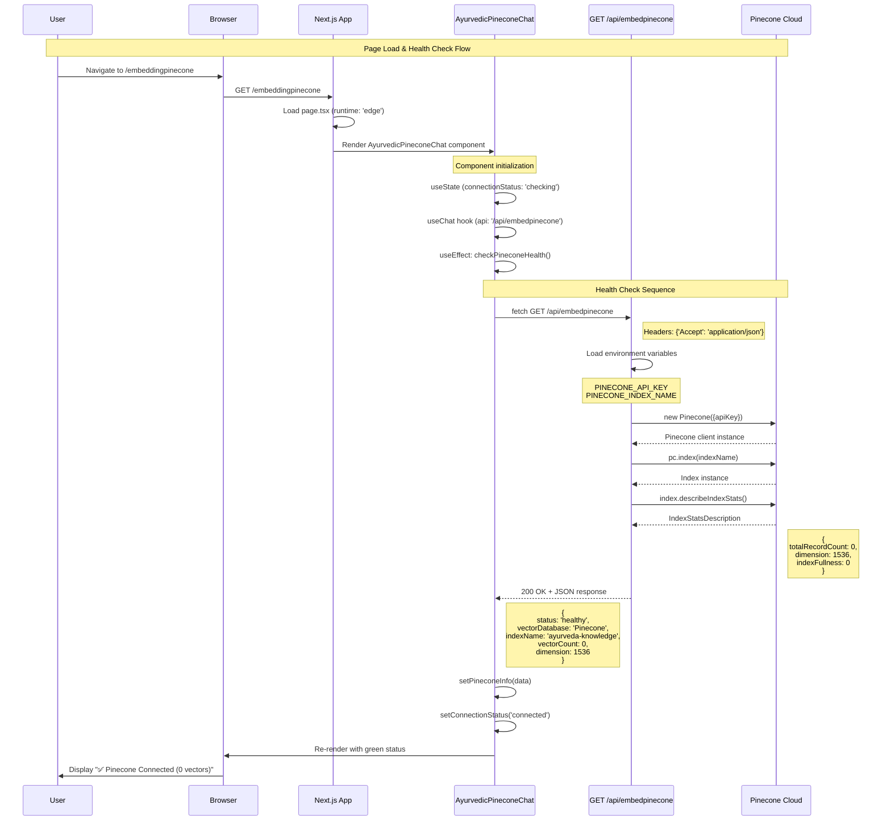
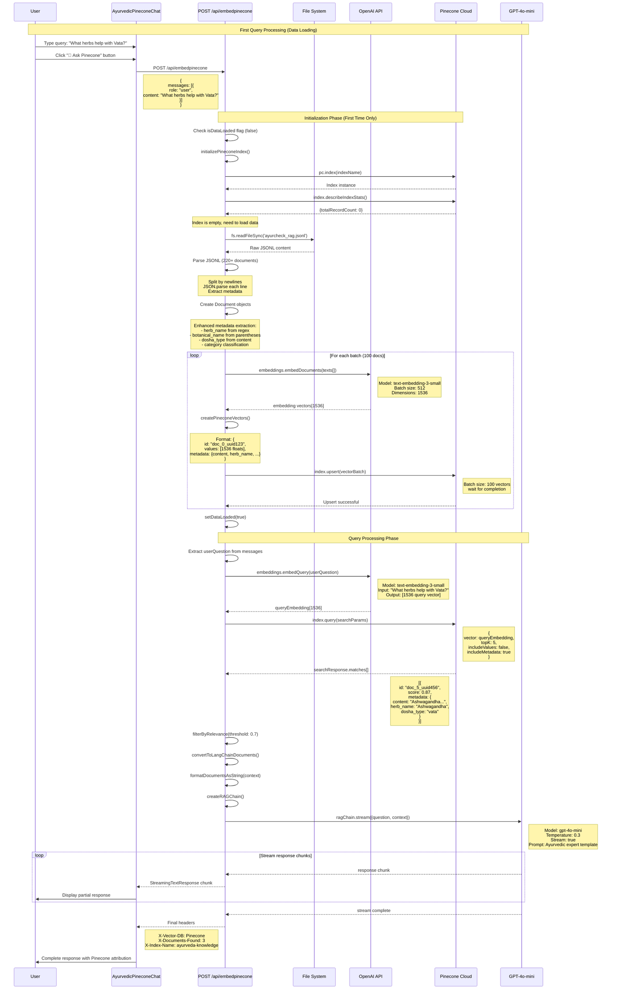
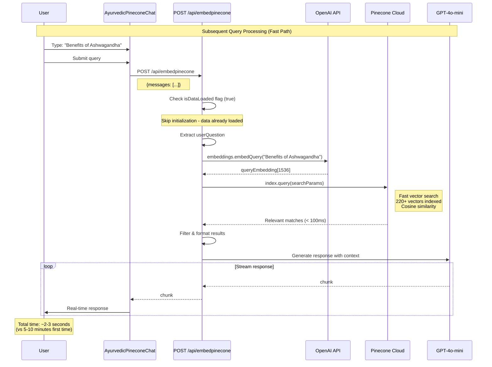

# Pinecone Low-Level Sequence Diagram

## Overview
This document provides detailed Mermaid sequence diagrams showing the exact flow when a user opens the `/embeddingpinecone` page and submits queries.

## 1. Page Load & Initialization Sequence



## 2. First Query & Data Initialization Sequence



## 3. Subsequent Query Sequence (Data Already Loaded)



## 4. Error Handling Flows

```mermaid
sequenceDiagram
    participant User
    participant PineconeChat as AyurvedicPineconeChat
    participant API as /api/embedpinecone
    participant PineconeCloud as Pinecone Cloud
    
    Note over User, PineconeCloud: Error Scenarios
    
    User->>PineconeChat: Open page
    PineconeChat->>API: Health check
    
    alt API Key Missing
        API->>API: Check process.env.PINECONE_API_KEY
        API-->>PineconeChat: 401 Unauthorized
        Note right of API: {error: "Pinecone API key missing"}
        PineconeChat->>PineconeChat: setConnectionStatus('disconnected')
        PineconeChat->>User: Show red warning banner
    
    else Index Not Found
        API->>PineconeCloud: Attempt connection
        PineconeCloud-->>API: 404 Index not found
        API-->>PineconeChat: 404 Error
        Note right of API: {error: "Index 'ayurveda-knowledge' not found"}
        PineconeChat->>User: Show error message with creation link
    
    else Rate Limiting
        API->>PineconeCloud: Too many requests
        PineconeCloud-->>API: 429 Rate limit exceeded
        API-->>PineconeChat: 429 Error
        PineconeChat->>User: Show rate limit warning
    
    else Network Issues
        API->>PineconeCloud: Connection timeout
        PineconeCloud-->>API: Network error
        API-->>PineconeChat: 503 Service unavailable
        PineconeChat->>User: Show connectivity error
    end
```



## Performance Metrics

| Phase | Operation | Time | Details |
|-------|-----------|------|---------|
| **Page Load** | Component render | ~100ms | Next.js SSG/SSR |
| **Health Check** | GET /api/embedpinecone | ~200-500ms | Network + Pinecone API |
| **First Query** | Data initialization | 5-10 min | JSONL parsing + embedding generation |
| **First Query** | Vector upload | 2-3 min | 220+ vectors to Pinecone (100/batch) |
| **First Query** | Query processing | ~2-3s | Embedding + search + LLM |
| **Subsequent** | Query processing | ~2-3s | Direct search (no initialization) |
| **Vector Search** | Pinecone similarity | ~50-200ms | 220+ vectors, cosine similarity |

## Configuration Summary

```typescript
// Environment Variables Required
PINECONE_API_KEY=pcsk_xxx...
PINECONE_INDEX_NAME=ayurveda-knowledge
OPENAI_API_KEY=sk-proj-xxx...

// Pinecone Index Specifications
{
  name: "ayurveda-knowledge",
  dimension: 1536,
  metric: "cosine",
  cloud: "aws",
  region: "us-east-1"
}

// Processing Configuration
{
  embeddingModel: "text-embedding-3-small",
  batchSize: 100, // vectors per Pinecone upload
  relevanceThreshold: 0.7,
  maxResults: 5,
  llmModel: "gpt-4o-mini"
}
```