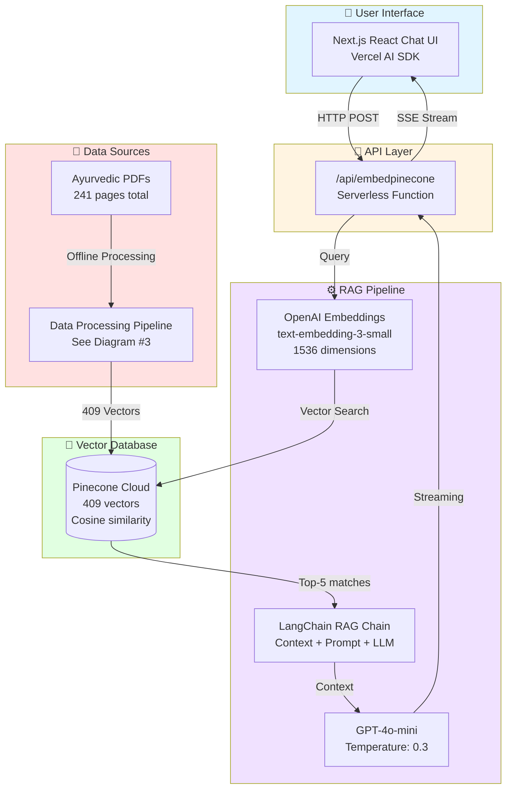
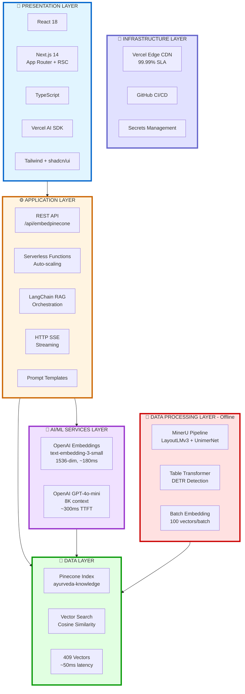
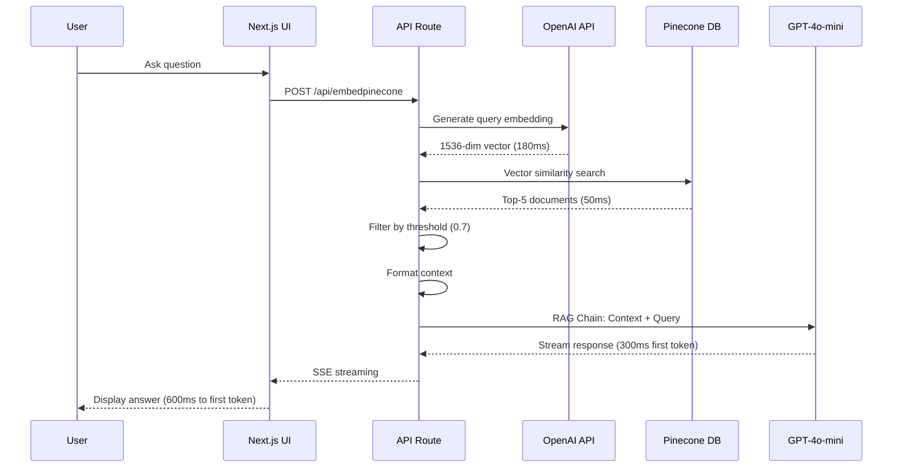
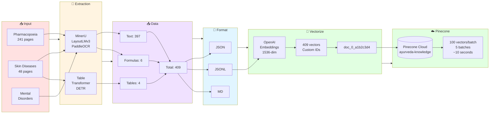
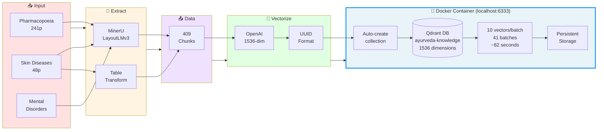
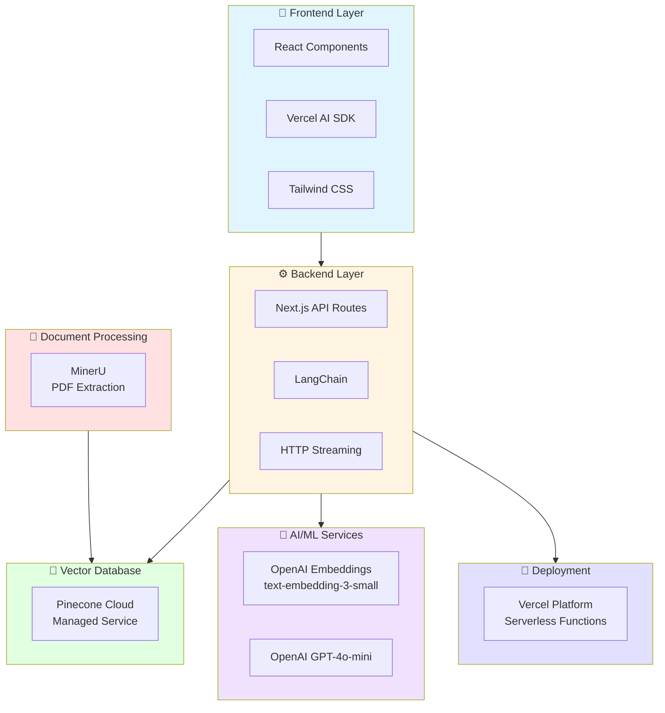
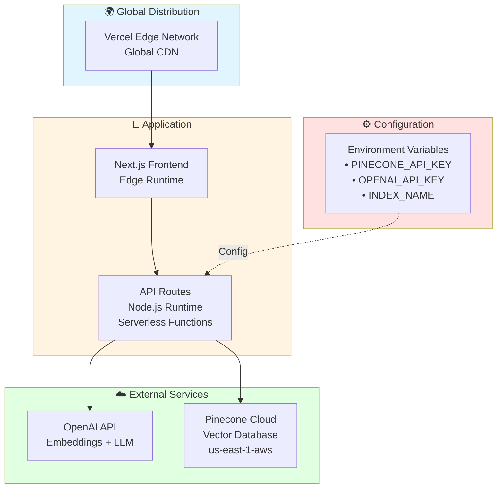

# RAG System Architecture Diagrams (Mermaid)

## 1. High-Level System Architecture



## 2. Technology Stack Overview (Layered Architecture)



## 3. RAG Query Flow



## 3.1 Data Processing Pipeline - Pinecone Flow (Production)



## 3.2 Data Processing Pipeline - Qdrant Flow (Alternative)



## 4. Technology Stack



## 5. Vector Search Process

```mermaid
flowchart TD
    Query[User Query:<br/>"What herbs help with Vata?"]
    
    subgraph Embed["Embedding Generation"]
        QueryEmbed[Convert to 1536-dim vector<br/>~180ms]
    end
    
    subgraph Search["Vector Search"]
        Pinecone[(Pinecone Index<br/>409 vectors)]
        Cosine[Cosine Similarity<br/>cos θ = q·d / ||q||||d||]
        TopK[Retrieve top-5 matches]
    end
    
    subgraph Filter["Post-Processing"]
        Threshold{Score ≥ 0.7?}
        Keep[Keep relevant docs]
        Fallback[Use top-3 as fallback]
    end
    
    subgraph RAG["RAG Generation"]
        Context[Format context from docs]
        Prompt[Inject into prompt template]
        Generate[GPT-4o-mini generation]
        Response[Streaming response]
    end
    
    Query --> QueryEmbed
    QueryEmbed --> Pinecone
    Pinecone --> Cosine
    Cosine --> TopK
    TopK --> Threshold
    Threshold -->|Yes| Keep
    Threshold -->|No| Fallback
    Keep --> Context
    Fallback --> Context
    Context --> Prompt
    Prompt --> Generate
    Generate --> Response
    
    style Query fill:#e1f5ff
    style Search fill:#e1ffe1
    style Filter fill:#fff4e1
    style RAG fill:#f0e1ff
```

## 6. Deployment Architecture



## 7. Performance Metrics

```mermaid
gantt
    title RAG Query Processing Timeline
    dateFormat X
    axisFormat %L ms
    
    section Query Processing
    Parse Request           :0, 20
    Generate Embedding      :20, 200
    Vector Search          :220, 70
    Filter Results         :290, 20
    Format Context         :310, 50
    
    section LLM Generation
    First Token            :360, 240
    Complete Stream        :600, 2400
    
    section User Experience
    First Token Visible    :crit, 600, 1
    Response Complete      :3000, 1
```



## Usage Instructions

Copy any of these Mermaid diagrams and paste them into:

1. **PowerPoint**: Use Mermaid plugins or convert to images
   - Online tool: https://mermaid.live/
   - Export as PNG/SVG for slides

2. **Markdown**: Works directly in GitHub, VS Code, etc.

3. **Documentation**: Include in technical docs

## Conversion Tips for PowerPoint

1. Visit https://mermaid.live/
2. Paste the Mermaid code
3. Customize colors/style if needed
4. Export as PNG (high resolution) or SVG
5. Insert image into PowerPoint slide

## Recommended Diagrams for Presentation

- **Slide 1**: Diagram #1 (High-Level System Architecture) - Overview
- **Slide 2**: Diagram #3 (RAG Query Flow) - How it works
- **Slide 3**: Diagram #3.1 (Data Processing Pipeline - Pinecone) - Main production flow
- **Slide 4**: Diagram #3.2 (Data Processing Pipeline - Qdrant) - Alternative implementation
- **Slide 5**: Diagram #4 (Technology Stack) - Tech components
- **Slide 6**: Diagram #7 (Performance Metrics) - Results

## Key Differences Between 3.1 (Pinecone) and 3.2 (Qdrant)

| Feature | Pinecone (3.1) | Qdrant (3.2) |
|---------|----------------|--------------|
| **Deployment** | Cloud-only (managed) | Local Docker container (`localhost:6333`) |
| **ID Format** | Custom short: `doc_0_a1b2c3d4` | Full UUID: `550e8400-e29b-...` |
| **Batch Size** | 100 vectors/batch | 10 vectors/batch |
| **Total Batches** | 5 batches | 41 batches |
| **Upload Time** | ~10 seconds | ~82 seconds |
| **Collection** | Manual creation required | Auto-creates if not exists |
| **Hosting** | Pinecone cloud servers | Docker container (local development) |
| **Connection** | Internet required | Localhost (no internet for DB) |
