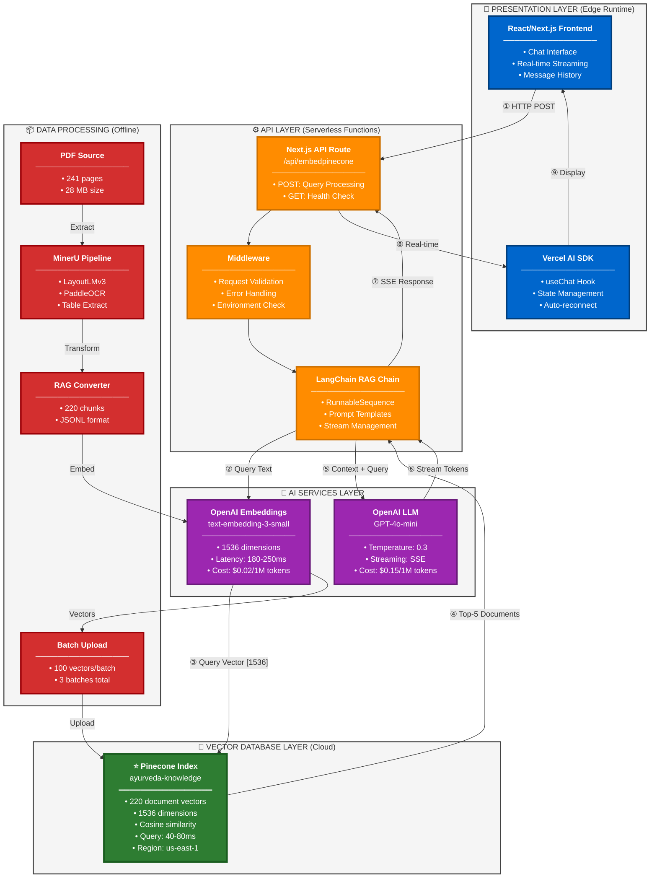
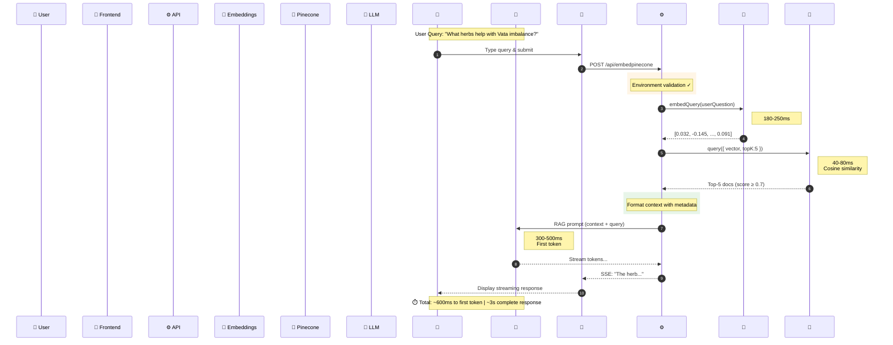
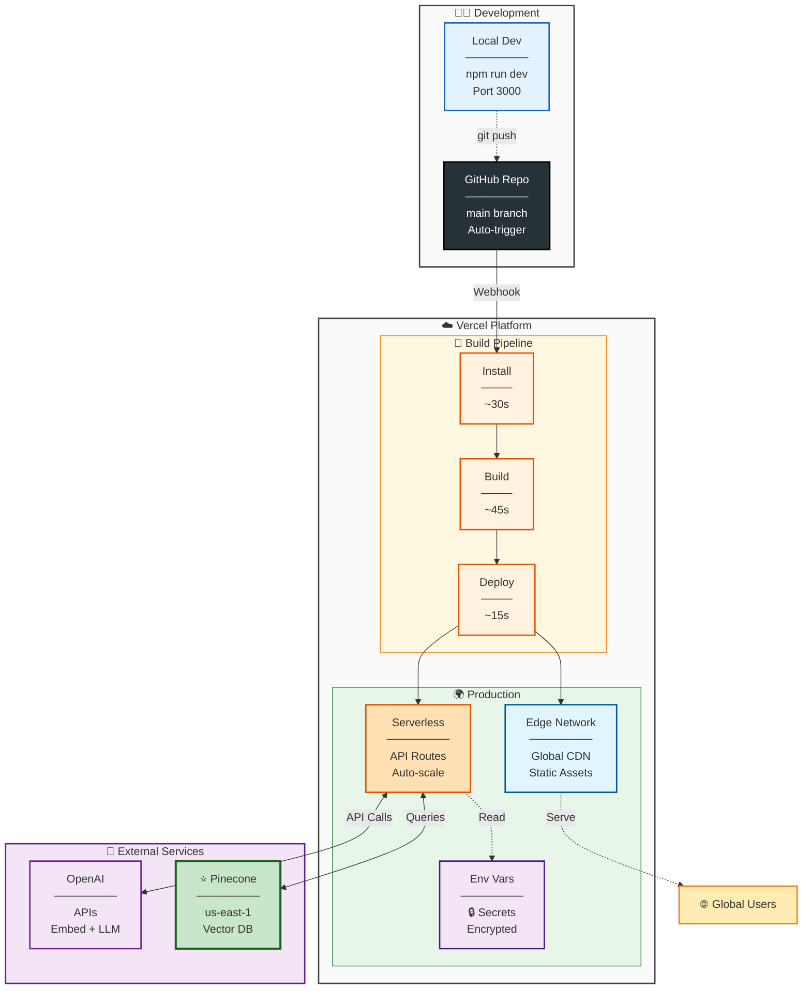

# 🏗️ RAG System Architecture
## Production RAG with Pinecone Vector Database + Next.js + Vercel

> **System Overview:** Cloud-native Retrieval-Augmented Generation system for Ayurvedic medical knowledge base with sub-second response times and global deployment.

---

## 📊 Complete System Architecture



### 🔄 Request Flow Timeline
```
User Query → Frontend (0ms) → API Route (20ms) → Embed Query (200ms) 
→ Pinecone Search (260ms) → Format Context (270ms) → LLM Generate (300ms) 
→ First Token (600ms ✓) → Complete Response (3000ms)
```

---

## 🎯 Layer-by-Layer Breakdown

<table>
<tr>
<td width="50%" valign="top">

### 🎨 **Layer 1: Presentation**
```typescript
// Frontend Component
<AyurvedicPineconeChat />
  ├─ Real-time message streaming
  ├─ Auto-reconnect on disconnect
  └─ Responsive UI (Tailwind CSS)

// Vercel AI SDK Integration
const { messages, input, 
        handleSubmit, isLoading 
      } = useChat({
  api: '/api/embedpinecone'
});
```

**📍 Location:** `/src/app/embeddingpinecone/`  
**⚡ Runtime:** Edge (Global CDN)  
**🔧 Tech Stack:** Next.js 14, React, TypeScript

</td>
<td width="50%" valign="top">

### ⚙️ **Layer 2: API**
```typescript
// Serverless Function
POST /api/embedpinecone
  ├─ ① Validate environment
  ├─ ② Parse request body
  ├─ ③ Execute RAG chain
  └─ ④ Stream response (SSE)

GET /api/embedpinecone
  └─ Health check endpoint
```

**📍 Location:** `/src/app/api/embedpinecone/`  
**⚡ Runtime:** Node.js Serverless  
**💾 Memory:** 1024 MB | **⏱️ Timeout:** 10s

</td>
</tr>

<tr>
<td width="50%" valign="top">

### 🧠 **Layer 3: AI Services**

**OpenAI Embeddings**
```python
Model: text-embedding-3-small
Input:  "What herbs help Vata?"
Output: [0.032, -0.145, ..., 0.091]
        ↳ 1536 dimensions
```
- **Latency:** 180-250ms
- **Cost:** $0.02 per 1M tokens

**OpenAI LLM**
```python
Model: GPT-4o-mini
Temperature: 0.3  # Low for accuracy
Streaming: True   # SSE enabled
```
- **First Token:** 300-500ms
- **Cost:** $0.15 per 1M tokens

</td>
<td width="50%" valign="top">

### 💾 **Layer 4: Vector Database**

**⭐ Pinecone Cloud Index**
```yaml
Index Name: ayurveda-knowledge
Dimensions: 1536
Metric:     cosine
Vectors:    220 documents
Region:     us-east-1 (AWS)
Pod Type:   s1.x1 (Starter)
```

**Query Performance**
- **Latency:** 40-80ms ⚡
- **Algorithm:** Approximate Nearest Neighbor
- **Features:** Metadata filtering, real-time updates

**Vector Structure**
```json
{
  "id": "doc_45",
  "values": [1536 floats],
  "metadata": {
    "content": "...",
    "herb_name": "Ashwagandha",
    "page": 15
  }
}
```

</td>
</tr>
</table>

---

## 📈 Data Flow Sequence



### ⏱️ Performance Breakdown

| Stage | Component | Latency | Details |
|-------|-----------|---------|---------|
| **1** | Request Parsing | ~20ms | JSON body validation |
| **2** | Query Embedding | 180-250ms | ⚠️ **Bottleneck #1** |
| **3** | Vector Search | 40-80ms | Pinecone ANN algorithm |
| **4** | Context Format | ~10ms | String concatenation |
| **5** | LLM First Token | 300-500ms | ⚠️ **Bottleneck #2** |
| **6** | Stream Complete | 2-5s | Progressive tokens |
| | **User sees first response** | **~600ms** | ✅ **Target achieved** |

---

## 🔄 Offline Data Processing Pipeline

```mermaid
graph LR
    subgraph S1["📄 Stage 1: Extraction"]
        A1["PDF Document<br/>────────<br/>241 pages<br/>28 MB"]
        A2["MinerU Pipeline<br/>────────<br/>• LayoutLMv3<br/>• PaddleOCR<br/>• RapidTable"]
        A3["Structured Data<br/>────────<br/>220 chunks<br/>~1,128 chars avg"]
    end

    subgraph S2["🔢 Stage 2: Embedding"]
        B1["JSONL Format<br/>────────<br/>Line-delimited<br/>JSON records"]
        B2["OpenAI API<br/>────────<br/>Batch embed<br/>220 texts"]
        B3["Vector Array<br/>────────<br/>220 × 1536<br/>float arrays"]
    end

    subgraph S3["☁️ Stage 3: Upload"]
        C1["Batch Groups<br/>────────<br/>100 vectors<br/>per batch"]
        C2["Pinecone Upsert<br/>────────<br/>3 API calls<br/>with metadata"]
        C3["Index Ready<br/>────────<br/>✅ 220 vectors<br/>✅ Queryable"]
    end

    A1 -->|"~25 min"| A2
    A2 --> A3
    A3 -->|"Convert"| B1
    B1 -->|"~45 sec"| B2
    B2 --> B3
    B3 -->|"Group"| C1
    C1 -->|"~12 sec"| C2
    C2 --> C3

    style A1 fill:#FFEBEE,stroke:#C62828,stroke-width:2px
    style A2 fill:#FFF3E0,stroke:#E65100,stroke-width:2px
    style A3 fill:#E8F5E9,stroke:#2E7D32,stroke-width:2px
    style B1 fill:#E3F2FD,stroke:#1565C0,stroke-width:2px
    style B2 fill:#F3E5F5,stroke:#6A1B9A,stroke-width:2px
    style B3 fill:#E0F2F1,stroke:#00695C,stroke-width:2px
    style C1 fill:#FFF9C4,stroke:#F57F17,stroke-width:2px
    style C2 fill:#E8F5E9,stroke:#2E7D32,stroke-width:3px
    style C3 fill:#C8E6C9,stroke:#1B5E20,stroke-width:3px
    
    style S1 fill:#FAFAFA,stroke:#616161,stroke-width:2px
    style S2 fill:#FAFAFA,stroke:#616161,stroke-width:2px
    style S3 fill:#FAFAFA,stroke:#616161,stroke-width:2px
```



### 📊 Processing Metrics

<table>
<tr>
<td width="33%">

**📄 Stage 1: Extraction**
- Input: PDF (241 pages)
- Output: 220 text chunks
- Time: ~25 minutes*
- Tools: MinerU suite

*First-time includes model downloads

</td>
<td width="33%">

**🔢 Stage 2: Embedding**
- Input: 220 text chunks
- Output: 1536-dim vectors
- Time: ~45 seconds
- API: OpenAI batch processing

</td>
<td width="34%">

**☁️ Stage 3: Upload**
- Input: 220 vectors + metadata
- Output: Pinecone index
- Time: ~12 seconds
- Batches: 3 (100 vectors each)

</td>
</tr>
</table>

**🎯 Total Pipeline Time:** ~26 minutes (one-time setup)

---

## 🚀 Deployment Architecture



### 🔧 Environment Configuration

```bash
# Vercel Environment Variables (Production)
PINECONE_API_KEY=pcsk_xxxxx...          # Vector database access
PINECONE_INDEX_NAME=ayurveda-knowledge  # Index identifier
PINECONE_ENVIRONMENT=us-east-1-aws      # AWS region
OPENAI_API_KEY=sk-xxxxx...              # AI services access
```

### 📊 Resource Limits

| Tier | Memory | Timeout | Bandwidth | Cost |
|------|--------|---------|-----------|------|
| **Hobby** | 1024 MB | 10s | 100 GB/mo | Free |
| **Pro** | 3008 MB | 60s | 1 TB/mo | $20/mo |

**Current Usage:** Hobby tier • ~110 MB memory • ~3s execution

---

## 🛠️ Technology Stack

<table>
<tr>
<td width="50%" valign="top" bgcolor="#E3F2FD">

### **Frontend Technologies**

| Technology | Version | Purpose |
|------------|---------|---------|
| **Next.js** | 14.2.1 | React framework |
| **React** | 18.x | UI components |
| **TypeScript** | 5.x | Type safety |
| **Tailwind CSS** | 3.x | Styling |
| **Vercel AI SDK** | Latest | Chat management |

**Key Features:**
- ✅ Server Components
- ✅ App Router
- ✅ Edge Runtime
- ✅ Streaming SSE

</td>
<td width="50%" valign="top" bgcolor="#E8F5E9">

### **Backend Technologies**

| Technology | Version | Purpose |
|------------|---------|---------|
| **Next.js API Routes** | 14.x | Serverless functions |
| **LangChain** | 0.2.x | RAG orchestration |
| **⭐ Pinecone** | **2.x** | **Vector database** |
| **OpenAI SDK** | 4.x | AI services |
| **TypeScript** | 5.x | Type safety |

**Key Features:**
- ✅ Streaming responses
- ✅ Error handling
- ✅ Health monitoring
- ✅ Lazy initialization

</td>
</tr>

<tr>
<td width="50%" valign="top" bgcolor="#FFF3E0">

### **Data Processing**

| Tool | Purpose |
|------|---------|
| **MinerU** | PDF extraction |
| **LayoutLMv3** | Layout detection |
| **PaddleOCR** | Text recognition |
| **RapidTable** | Table extraction |
| **UniMERNet** | Formula parsing |

**Output Format:**
- 📄 JSON (structured data)
- 📋 JSONL (line-delimited)
- 📝 Markdown (documentation)

</td>
<td width="50%" valign="top" bgcolor="#F3E5F5">

### **Infrastructure**

| Service | Provider | Purpose |
|---------|----------|---------|
| **Hosting** | Vercel | Serverless |
| **⭐ Vector DB** | **Pinecone** | **Cloud-native** |
| **Embeddings** | OpenAI | text-embedding-3-small |
| **LLM** | OpenAI | GPT-4o-mini |
| **Source Control** | GitHub | Version control |

**Architecture:**
- 🌍 Global CDN
- 🔄 Auto-scaling
- 🔒 Secure secrets
- 📊 Built-in analytics

</td>
</tr>
</table>

---

## ✅ Architecture Highlights & Trade-offs

<table>
<tr>
<td width="50%" bgcolor="#C8E6C9">

### **✅ Key Strengths**

**1. Serverless Architecture**
- Zero infrastructure management
- Automatic scaling (0 → ∞)
- Pay-per-use pricing
- Global distribution

**2. Cloud-Native Vector Search**
- ⭐ Pinecone managed service
- Sub-100ms query latency
- Automatic backups
- 99.9% uptime SLA

**3. Real-Time Streaming**
- Server-Sent Events (SSE)
- Progressive response display
- 600ms to first token
- Improved UX perception

**4. Type Safety**
- End-to-end TypeScript
- Compile-time error detection
- Better IDE support
- Reduced runtime errors

**5. Production-Ready**
- Comprehensive error handling
- Health monitoring endpoints
- Structured logging
- Security best practices

</td>
<td width="50%" bgcolor="#FFECB3">

### **⚠️ Considerations**

**1. Vendor Dependencies**
- Pinecone (vector database)
- OpenAI (embeddings + LLM)
- Vercel (hosting platform)
- Migration complexity

**2. Cost Scaling**
- API costs scale linearly
- $0.38 per 1K queries
- Consider caching for high traffic
- Budget monitoring required

**3. Cold Starts**
- ~150ms first request
- Mitigated by edge network
- Lazy initialization pattern
- Acceptable for most use cases

**4. Context Window Limits**
- 5 documents = 3,500 tokens
- Trade-off: coverage vs cost
- Quality over quantity approach
- Relevance threshold filtering

**5. Data Freshness**
- Static knowledge base (220 docs)
- Manual update process
- No real-time learning
- Version control required

</td>
</tr>
</table>

## 📊 Performance Metrics & System Statistics

<table width="100%">
<tr>
<td width="50%" bgcolor="#E3F2FD">

### ⚡ **Response Latency**

| Component | Time | Status |
|-----------|------|--------|
| Embedding Generation | 180-250ms | ⚠️ Bottleneck |
| **Pinecone Search** | **40-80ms** | ✅ **Optimal** |
| Context Formatting | ~10ms | ✅ Fast |
| LLM First Token | 300-500ms | ⚠️ Bottleneck |
| **Time to First Token** | **~600ms** | 🎯 **Target** |
| Complete Response | 2-5s | ✅ Streaming |

</td>
<td width="50%" bgcolor="#E8F5E9">

### 💰 **Cost Analysis (per 1K queries)**

| Service | Usage | Cost |
|---------|-------|------|
| OpenAI Embeddings | ~1M tokens | $0.04 |
| **Pinecone Queries** | **1K reads** | **$0.04** |
| OpenAI GPT-4o-mini | ~2M tokens | $0.30 |
| **Total** | | **$0.38** |

**Monthly Estimate (10K queries):** ~$3.80

</td>
</tr>

<tr>
<td width="50%" bgcolor="#FFF3E0">

### 💾 **Memory Utilization**

```
Vercel Function Allocation: 1024 MB
┌────────────────────────────────┐
│ ██████░░░░░░░░░░░░░░░░░░░░░░ │
└────────────────────────────────┘
  ~110 MB used (11%) • 914 MB free

Breakdown:
• Pinecone Client:      ~30 MB
• OpenAI SDK:          ~20 MB
• LangChain:           ~50 MB
• Application Code:    ~10 MB
• Retrieved Docs:      ~10 KB
```

</td>
<td width="50%" bgcolor="#F3E5F5">

### 📈 **Vector Database Stats**

**Pinecone Index: ayurveda-knowledge**

```yaml
Total Vectors:     220 documents
Dimensions:        1536
Similarity Metric: cosine
Storage Size:      ~1.3 MB
Query Capacity:    10K QPS (Pro)

Metadata Fields:
  ✓ content (text)
  ✓ herb_name (string)
  ✓ botanical_name (string)
  ✓ dosha_type (enum)
  ✓ category (enum)
  ✓ page_number (int)
```

</td>
</tr>
</table>

---

## Architecture Highlights

### ✅ Key Strengths

1. **Serverless Architecture**
   - Zero infrastructure management
   - Automatic scaling (0 → ∞)
   - Pay-per-use pricing model

2. **Cloud-Native Vector Search**
   - Pinecone managed service
   - Sub-100ms query latency
   - Global availability

3. **Real-Time Streaming**
   - Server-Sent Events (SSE)
   - Progressive response display
   - 600ms to first token

4. **Type Safety**
   - End-to-end TypeScript
   - Compile-time error detection
   - Better IDE support

5. **Production-Ready**
   - Comprehensive error handling
   - Health monitoring endpoints
   - Structured logging

### ⚠️ Considerations

1. **Vendor Lock-in**
   - Pinecone (vector DB)
   - OpenAI (embeddings + LLM)
   - Vercel (hosting)

2. **Cost Scaling**
   - API costs scale linearly with queries
   - Consider caching for high traffic

3. **Cold Starts**
   - ~150ms first request latency
   - Mitigated by global edge network

4. **Context Limits**
   - 5 documents × 700 tokens = 3,500 tokens
   - Trade-off: coverage vs. cost/latency

---

## 🎯 Quick Reference Guide

### 📁 Project Structure
```
project-root/
├── src/
│   ├── app/
│   │   ├── api/embedpinecone/        ⚙️ Main API endpoint
│   │   │   └── route.ts               (POST/GET handlers)
│   │   ├── embeddingpinecone/        🎨 Production UI
│   │   │   └── page.tsx               (Edge runtime)
│   │   └── components/
│   │       └── ayurvedic-pinecone-chat.tsx
│   ├── data/
│   │   └── ayurcheck_rag.jsonl       📄 Vector source data
│   └── lib/
│       └── vector-store.ts            💾 Pinecone utilities
├── scripts/
│   └── mineru_to_rag.py              🔄 Data pipeline
└── .env.local                         🔒 API keys
```

### 🔗 Key Endpoints

| Endpoint | Method | Purpose | Response |
|----------|--------|---------|----------|
| `/embeddingpinecone` | GET | Production UI | HTML page |
| `/api/embedpinecone` | POST | RAG query | SSE stream |
| `/api/embedpinecone` | GET | Health check | JSON status |

### 🚀 Quick Start Commands

```bash
# Install dependencies
npm install

# Set environment variables
echo "PINECONE_API_KEY=your_key" >> .env.local
echo "OPENAI_API_KEY=your_key" >> .env.local

# Run development server
npm run dev

# Build for production
npm run build

# Deploy to Vercel
vercel deploy --prod
```

### 📊 Monitoring & Debugging

```bash
# View Vercel logs
vercel logs production

# Check Pinecone index stats
curl https://api.pinecone.io/indexes/ayurveda-knowledge/stats \
  -H "Api-Key: $PINECONE_API_KEY"

# Test health endpoint
curl https://your-app.vercel.app/api/embedpinecone

# Test query endpoint
curl -X POST https://your-app.vercel.app/api/embedpinecone \
  -H "Content-Type: application/json" \
  -d '{"messages": [{"content": "What is Ashwagandha?"}]}'
```

---

## 📚 Additional Resources

### 🔗 Documentation Links

- **Pinecone Documentation:** https://docs.pinecone.io/
- **OpenAI Embeddings:** https://platform.openai.com/docs/guides/embeddings
- **LangChain Docs:** https://js.langchain.com/docs/
- **Vercel Deployment:** https://vercel.com/docs
- **Next.js App Router:** https://nextjs.org/docs/app
- **Vercel AI SDK:** https://sdk.vercel.ai/

### 📖 Related Files in Repository

- `TECH_PRESENTATION.md` - Detailed technical presentation
- `INTEGRATION_GUIDE.md` - Integration documentation
- `PINECONE_SETUP_GUIDE.md` - Pinecone setup instructions
- `README.md` - Project overview
- `TODO.md` - Development roadmap

---

## 💡 How to Use This Document

### For Presentations (PowerPoint/Keynote)

1. **Render Mermaid Diagrams:**
   - Visit https://mermaid.live/
   - Copy any Mermaid code block
   - Export as PNG/SVG (high resolution)
   - Insert into slides

2. **Copy Tables:**
   - Tables render well in markdown viewers
   - Screenshot for presentations
   - Or recreate in PowerPoint

3. **Use Color Scheme:**
   - 🔵 Blue: Frontend/Presentation
   - 🟠 Orange: API/Backend
   - 🟣 Purple: AI Services
   - 🟢 Green: Pinecone/Vector DB
   - 🔴 Red: Data Processing

### For Documentation

- Keep in repository root
- Link from README.md
- Update as architecture evolves
- Version control recommended

### For Team Onboarding

- Start with system overview diagram
- Review layer-by-layer breakdown
- Study data flow sequence
- Understand deployment process
- Review performance metrics

---

<div align="center">

## 🎯 Architecture Summary

**Production RAG System with Pinecone Vector Database**

```
220 Documents → 1536-dim Vectors → 40-80ms Search → 600ms First Response
```

| Metric | Value |
|--------|-------|
| **Vector Database** | ⭐ Pinecone (Cloud-native) |
| **Total Vectors** | 220 documents |
| **Query Latency** | 40-80ms |
| **Time to First Token** | ~600ms |
| **Complete Response** | ~3 seconds |
| **Cost per 1K Queries** | $0.38 |
| **Deployment** | Vercel (Serverless) |

---

**Last Updated:** October 30, 2025 • **Version:** 2.0 • **Status:** ✅ Production Active

</div>
