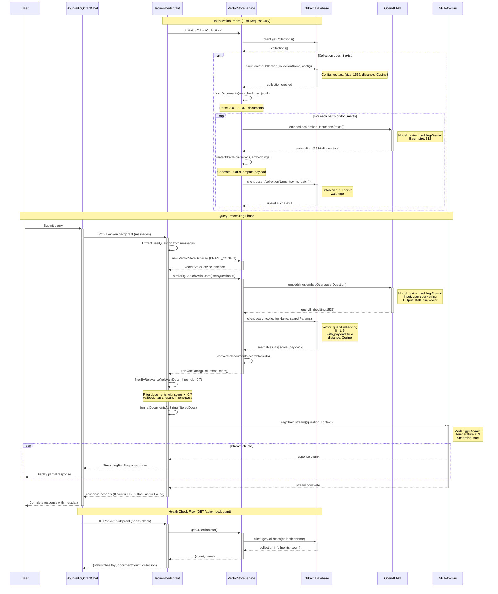

# Qdrant Call Sequence Documentation

## Overview
This document outlines the exact call sequence when a user submits a query to the Qdrant-powered Ayurvedic Knowledge Assistant in the Next.js RAG application.

## Architecture Components

### Frontend Components
- **Page**: `/src/app/embeddingqdrant/page.tsx` → `AyurvedicQdrantChat` component
- **API Route**: `/src/app/api/embedqdrant/route.ts`
- **Vector Store**: `/src/lib/vector-store.ts` → `QdrantVectorStore` class

### Embedding Model Used
- **Model**: `text-embedding-3-small` (OpenAI)
- **Dimensions**: 1536
- **Distance Metric**: Cosine similarity
- **Batch Size**: 512 documents per batch

## Detailed Call Sequence

### 1. User Query Initiation
```typescript
// Component: AyurvedicQdrantChat
const { messages, input, handleInputChange, handleSubmit, isLoading } = useChat({
  api: '/api/embedqdrant',  // ← API endpoint
  initialMessages: [...]
});
```

### 2. API Route Processing (`POST /api/embedqdrant`)

#### Step 2.1: Collection Initialization (First Time Only)
```typescript
// Check if Qdrant collection exists and has data
await initializeQdrantCollection()
```

**Qdrant Operations:**
1. **Collection Check**: `await this.client.getCollections()`
2. **Collection Creation** (if needed):
   ```typescript
   await this.client.createCollection(collectionName, {
     vectors: {
       size: 1536,           // OpenAI embedding dimensions
       distance: 'Cosine',   // Distance metric
     },
   })
   ```

#### Step 2.2: Data Loading (First Time Only)
```typescript
// Load from: src/data/ayurcheck_rag.jsonl
const rawData = fileContent.trim().split('\n').map(line => JSON.parse(line));
```

**Document Processing:**
1. **Text Extraction**: Extract content from JSONL format
2. **Metadata Enhancement**: Parse herb names, botanical names, dosha types
3. **Document Creation**: Convert to LangChain Document format with AyurvedaMetadata

#### Step 2.3: Embedding Generation & Vector Storage
```typescript
// Generate embeddings for all documents
const texts = documents.map(doc => doc.pageContent);
const embeddings = await this.embeddings.embedDocuments(texts);
```

**Qdrant Upload Sequence:**
1. **Embedding API Call**: OpenAI `text-embedding-3-small` model
2. **Point Creation**: Convert to Qdrant points with UUID
3. **Batch Upload**: Upload in batches of 10 points
   ```typescript
   await this.client.upsert(collectionName, {
     wait: true,
     points: batch,
   });
   ```

### 3. Query Processing

#### Step 3.1: Query Embedding
```typescript
const userQuestion = messages[messages.length - 1]?.content;
// Generate embedding for user query
const queryEmbedding = await this.embeddings.embedQuery(userQuestion);
```

**API Call:**
- **Service**: OpenAI Embeddings API
- **Model**: `text-embedding-3-small`
- **Input**: User's question string
- **Output**: 1536-dimensional vector

#### Step 3.2: Vector Similarity Search
```typescript
const searchResult = await this.client.search(collectionName, {
  vector: queryEmbedding,
  limit: k,              // Default: 5 results
  filter: qdrantFilter,  // Optional metadata filtering
  with_payload: true,    // Include document content + metadata
});
```

**Qdrant Search Operations:**
1. **Vector Search**: Cosine similarity search against 220+ stored vectors
2. **Scoring**: Returns similarity scores (0.0 - 1.0)
3. **Payload Retrieval**: Returns document content + metadata
4. **Filtering** (optional): By dosha_type, category, herb_name, etc.

#### Step 3.3: Relevance Filtering
```typescript
const relevanceThreshold = 0.7;
const filteredDocs = relevantDocs
  .filter(([_, score]) => score >= relevanceThreshold)
  .map(([doc, _]) => doc);
```

### 4. RAG Response Generation

#### Step 4.1: Context Preparation
```typescript
const ragChain = RunnableSequence.from([
  {
    context: () => formatDocumentsAsString(filteredDocs),
    question: (input: { question: string }) => input.question,
  },
  ragPromptTemplate,
  chatModel,
  new HttpResponseOutputParser(),
]);
```

#### Step 4.2: LLM Generation
```typescript
const chatModel = new ChatOpenAI({
  modelName: 'gpt-4o-mini',
  temperature: 0.3,
  streaming: true,
});
```

**Final API Calls:**
1. **Context Formatting**: Convert retrieved documents to text
2. **Prompt Template**: Apply Ayurvedic medicine prompt template
3. **LLM Generation**: OpenAI GPT-4o-mini with streaming
4. **Stream Response**: Return streamed response to frontend

## Complete Flow Summary

```
User Query → useChat Hook → POST /api/embedqdrant → VectorStoreService
    ↓
Initialize Qdrant Collection (if needed)
    ↓
Load & Process JSONL Data (220+ documents)
    ↓
Generate Embeddings (OpenAI text-embedding-3-small)
    ↓
Store Vectors in Qdrant (1536-dim, Cosine similarity)
    ↓
Process User Query:
    ├── Generate Query Embedding (OpenAI API)
    ├── Vector Similarity Search (Qdrant)
    ├── Filter by Relevance (threshold: 0.7)
    └── Format Context Documents
    ↓
RAG Chain Execution:
    ├── Apply Ayurvedic Prompt Template
    ├── Generate Response (GPT-4o-mini)
    └── Stream Response
    ↓
Frontend Receives Streamed Response
```

## Detailed Mermaid Sequence Diagram



## Database Configuration

### Qdrant Configuration
```typescript
const QDRANT_CONFIG = {
  url: process.env.QDRANT_URL || 'http://localhost:6333',
  collectionName: process.env.QDRANT_COLLECTION || 'ayurveda-knowledge',
  apiKey: process.env.QDRANT_API_KEY, // Optional for local setup
  useVectorDB: true,
  vectorDBType: 'qdrant' as const,
};
```

### Collection Schema
- **Name**: `ayurveda-knowledge`
- **Vector Dimensions**: 1536
- **Distance Function**: Cosine
- **Document Count**: 220+ Ayurvedic documents
- **Metadata Fields**: herb_name, botanical_name, dosha_type, category, benefits, usage, caution

## Error Handling

### Connection Errors
```typescript
if (error.message.includes('ECONNREFUSED')) {
  return NextResponse.json({
    error: 'Qdrant database connection failed. Please ensure Qdrant server is running on localhost:6333',
    details: 'Run: docker run -p 6333:6333 -p 6334:6334 qdrant/qdrant:latest',
  }, { status: 503 });
}
```

### Health Check Endpoint
```typescript
GET /api/embedqdrant → Returns collection status, document count, and connection health
```

## Performance Characteristics & Technical Specifications

### Timing Breakdown
- **Initial Setup**: ~25 minutes (first-time data loading & embedding generation)
- **Query Response**: ~2-5 seconds total breakdown:
  - Query embedding: ~200-500ms (OpenAI API call)
  - Vector search: ~50-200ms (Qdrant cosine similarity)
  - Document filtering: ~10-50ms (relevance threshold)
  - LLM response: ~1-4 seconds (GPT-4o-mini streaming)
- **Vector Search**: Sub-second (220+ documents indexed)
- **Relevance Threshold**: 0.7 (adjustable)
- **Batch Processing**: 10 documents per Qdrant upload batch

### Low-Level API Call Details

#### OpenAI Embedding Calls
```typescript
// Query-time embedding (per user query)
POST https://api.openai.com/v1/embeddings
{
  "model": "text-embedding-3-small",
  "input": "user_query_string",
  "encoding_format": "float"
}
// Response: 1536-dimensional float array

// Bulk embedding (initialization only)
POST https://api.openai.com/v1/embeddings
{
  "model": "text-embedding-3-small", 
  "input": ["doc1", "doc2", ...], // Batch of 512 docs max
  "encoding_format": "float"
}
```

#### Qdrant Database Calls
```typescript
// Collection Creation (one-time)
PUT http://localhost:6333/collections/ayurveda-knowledge
{
  "vectors": {
    "size": 1536,
    "distance": "Cosine"
  }
}

// Vector Upload (batch)
PUT http://localhost:6333/collections/ayurveda-knowledge/points
{
  "points": [
    {
      "id": "uuid-string",
      "vector": [1536 float values],
      "payload": {
        "content": "document text",
        "herb_name": "Ashwagandha",
        "category": "herb",
        ...metadata
      }
    }
  ],
  "wait": true
}

// Vector Search (per query)
POST http://localhost:6333/collections/ayurveda-knowledge/points/search
{
  "vector": [1536 query embedding values],
  "limit": 5,
  "with_payload": true,
  "score_threshold": 0.7
}
```

#### GPT-4o-mini Generation
```typescript
POST https://api.openai.com/v1/chat/completions
{
  "model": "gpt-4o-mini",
  "messages": [
    {
      "role": "system", 
      "content": "Ayurvedic expert prompt with context"
    },
    {
      "role": "user",
      "content": "user_question"
    }
  ],
  "temperature": 0.3,
  "stream": true
}
```

## Data Source
- **File**: `src/data/ayurcheck_rag.jsonl`
- **Source**: Ayurvedic Pharmacopoeia Volume 1 (241 pages)
- **Processing**: MinerU enhanced PDF-to-JSON conversion
- **Format**: JSONL with structured metadata per document