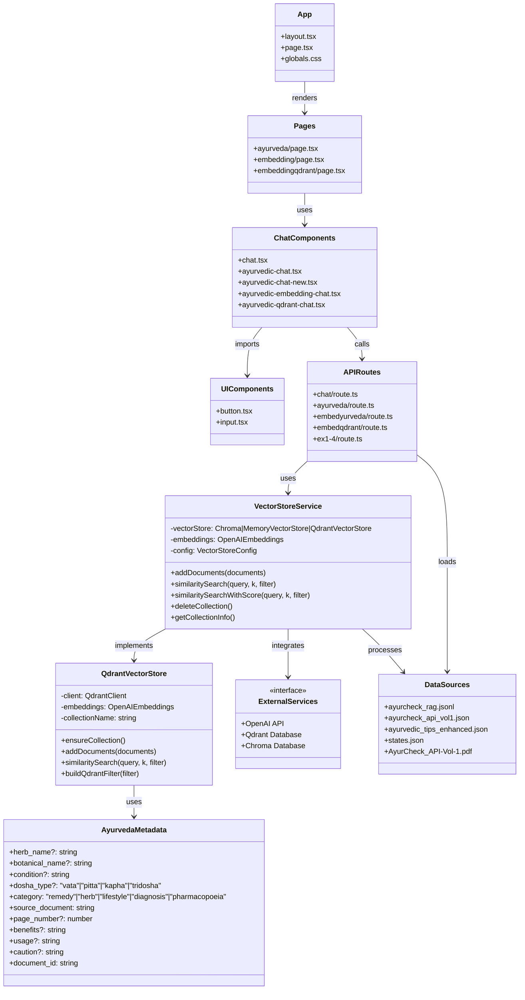
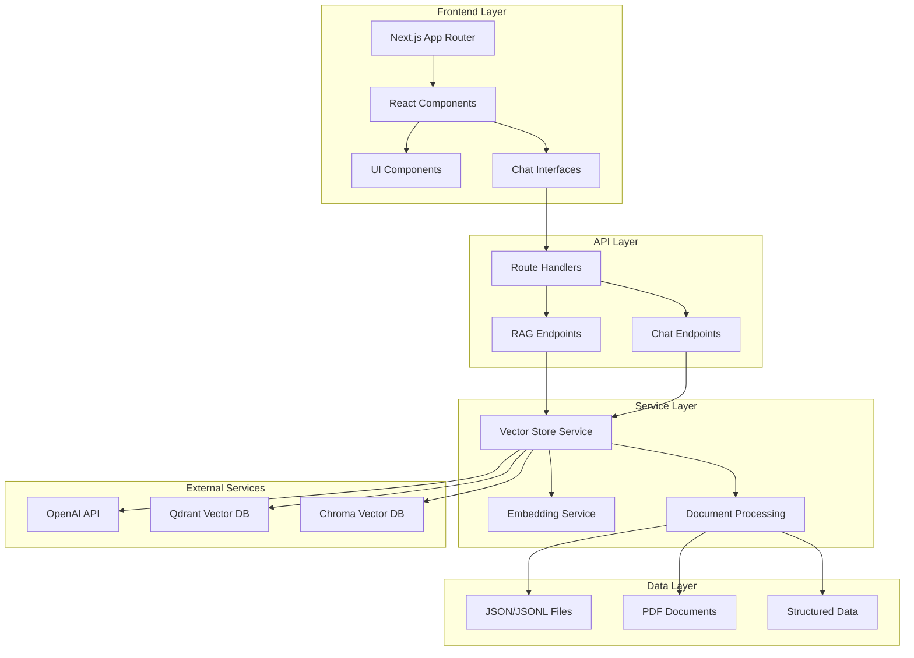

# High-Level UML Architecture Diagram for src/

## System Overview
This is a Next.js-based RAG (Retrieval-Augmented Generation) application for Ayurvedic medicine knowledge, featuring vector database integration with Qdrant, Chroma, and in-memory storage options.

## UML Class Diagram

## Component Architecture Diagram

## Key Components Description

### 1. **Presentation Layer**
- **App Router Structure**: Next.js 13+ app directory with layout and pages
- **React Components**: Specialized chat interfaces for Ayurvedic knowledge
- **UI Components**: Reusable shadcn/ui components (Button, Input)

### 2. **API Layer**
- **Route Handlers**: RESTful endpoints for chat and RAG functionality
- **Specialized Endpoints**: 
  - `/api/embedqdrant` - Qdrant-powered RAG
  - `/api/embedyurveda` - Ayurveda-specific embeddings
  - `/api/chat` - Basic OpenAI chat

### 3. **Service Layer**
- **VectorStoreService**: Unified interface for multiple vector databases
- **QdrantVectorStore**: Specialized Qdrant implementation
- **Embedding Integration**: OpenAI text-embedding-3-small model

### 4. **Data Layer**
- **Structured Data**: JSONL format for RAG documents
- **Source Documents**: PDF processing and JSON conversion
- **Metadata**: Rich Ayurvedic metadata with dosha types and categories

### 5. **External Integrations**
- **OpenAI**: GPT models and embeddings
- **Qdrant**: High-performance vector database
- **Chroma**: Alternative vector database option

## Architecture Patterns

1. **RAG Pattern**: Retrieval-Augmented Generation for knowledge-based responses
2. **Strategy Pattern**: Multiple vector store implementations
3. **Factory Pattern**: Vector store service creation
4. **Repository Pattern**: Data access abstraction
5. **Microservices**: Separate API endpoints for different functionalities

## Technology Stack

- **Frontend**: Next.js 13+, React, TypeScript, Tailwind CSS
- **Backend**: Next.js API Routes, Node.js
- **Vector Databases**: Qdrant, Chroma, In-memory
- **AI/ML**: OpenAI GPT-4, OpenAI Embeddings
- **Data Processing**: LangChain, Document processing
- **UI Framework**: shadcn/ui, Radix UI