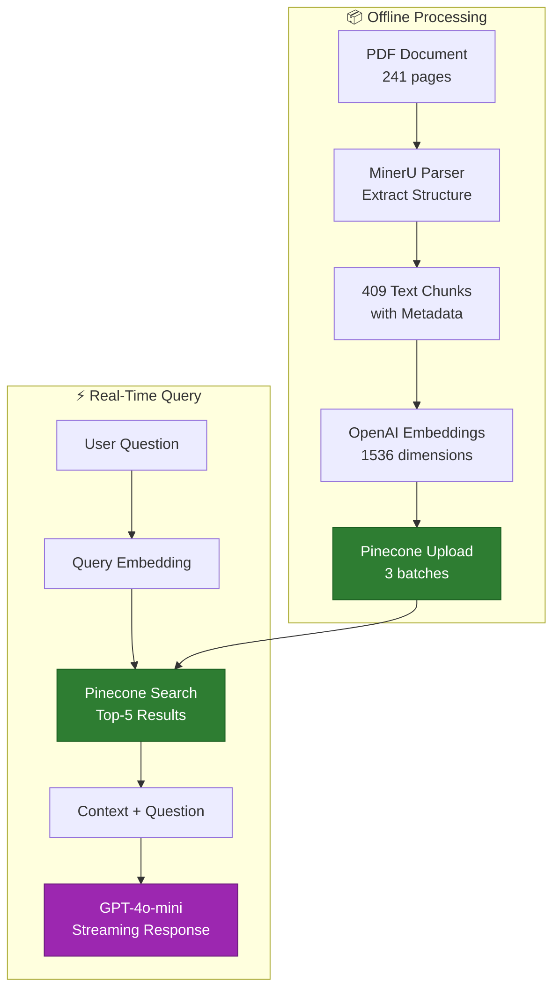

# C. Methodology Overview

## Methodology Steps
1.  **Document Processing**: MinerU extracts structured content from PDF preserving medical terminology.
2.  **Vector Embeddings**: OpenAI `text-embedding-3-small` creates 1536-dimensional semantic vectors.
3.  **Pinecone Vector DB**: Stores 409 document chunks with Ayurveda-specific metadata in the cloud.
4.  **Semantic Search**: Finds top-5 most relevant documents from 3 namespaces of Pinecone using cosine similarity (threshold: 0.7).
5.  **LLM Generation**: GPT-4o-mini generates contextual answers with source citations.

## System Architecture Deep Dive
The system follows a **Three-Tier Architecture with Vector Database Layer**:

### 1. Frontend Layer (React/Next.js)
*   Chat interface with streaming support.
*   Vercel AI SDK for state management.
*   Edge runtime for global distribution.

### 2. API Layer (Next.js Serverless Functions)
*   `/api/embedpinecone` route handler.
*   Request validation and error handling.
*   LangChain RAG chain orchestration.

### 3. Backend Services
*   **OpenAI API**: `text-embedding-3-small` (1536-d).
*   **Pinecone Vector DB**: 1536-d vectors, Cosine similarity, ~220 chunks.

